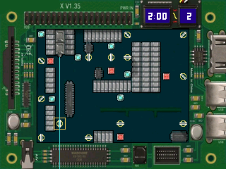

# Jiawei Ye — Portfolio

Personal portfolio for **Jiawei (Jacky) Ye**, a Computer Engineering student and hardware/software engineer. The site presents embedded systems, FPGA, RF, and AI work through project case studies and playable browser recreations.

**[Visit the live site](https://oldyemeister.github.io)**

[](https://oldyemeister.github.io)

## Featured projects

| Project | What it demonstrates | Demo |
| --- | --- | --- |
| Laser Puzzle | A Canvas recreation of a DE1-SoC laser-reflection game, with the original board geometry, mirrors, targets, hazards, timer, and lives | [Solve the puzzle](https://oldyemeister.github.io/projects/laser/) |
| Donkey Kong FPGA Game | A browser version of a Verilog platform game using its original sprites, movement timing, collision rules, and win condition | [Play the game](https://oldyemeister.github.io/projects/donkey-kong/) |
| IMU Sandbox | A Three.js recreation of an STM32, BNO055, and OLED particle sandbox with roll, pitch, yaw, gravity, and material controls | [Alter gravity](https://oldyemeister.github.io/projects/imu-sandbox/) |
| RF Frequency Downconversion System | A case study covering the design, assembly, and validation of an analog receiver PCB | [Read the case study](https://oldyemeister.github.io/projects/rf-receiver/) |
| Vision-Assisted Adaptive Cruise Control | A Raspberry Pi vehicle combining PID control, lane keeping, emergency braking, and stop-sign detection | [Read the case study](https://oldyemeister.github.io/projects/aps380/) |

## Highlights

- Responsive, accessible portfolio with light and dark themes
- Content managed from a single YAML file
- Keyboard, pointer, and touch support for interactive projects
- Reduced-motion support for animated project previews
- Locally hosted Three.js assets with no runtime CDN dependency
- Static output designed for GitHub Pages
- Automated tests for all three interactive project engines

## Built with

- Jekyll, Liquid, HTML, and CSS
- Vanilla JavaScript and Canvas
- Three.js
- Node.js' built-in test runner
- GitHub Pages

## Run locally

The repository has no npm package dependencies. To use the included preview builder, install:

- Node.js 20.11 or newer
- Ruby with the standard `yaml` library

Then clone and build the site:

```sh
git clone https://github.com/oldyemeister/oldyemeister.github.io.git
cd oldyemeister.github.io
npm run preview:build
```

The rendered site is written to `/private/tmp/personal-website-preview`. Serve that directory with any static file server, for example:

```sh
python3 -m http.server 8000 --directory /private/tmp/personal-website-preview
```

Open <http://localhost:8000> in a browser.

## Development commands

```sh
npm test                 # Run the interactive engine tests
npm run assets           # Regenerate game assets from archived hardware sources
npm run preview:build    # Build a local static preview
npm run build            # Build the published site into _site/
```

The asset conversion scripts expect the original project sources under `tools/.reference/demos/`. Those reference files are used for local regeneration and are not part of the deployed site.

## Updating the portfolio

Edit `_data/content.yml` to update your profile, experience, and project summaries.
Project pages, styling, and interactive demos live in the directories below.

| Location | Purpose |
| --- | --- |
| `_data/content.yml` | Profile, experience, and project content |
| `index.html`, `projects/`, `404.html` | Homepage, project pages, and error page |
| `_layouts/`, `_includes/` | Base layouts and reusable components |
| `assets/css/`, `assets/themes/` | Styles, themes, and web fonts |
| `templates/` | Design templates and page rendering |
| `assets/js/` | Game engines and supporting scripts |
| `assets/images/`, `assets/documents/`, `assets/vendor/` | Images, documents, and bundled libraries |
| `docs/` | Editing guide, attribution, and publishing notes |
| `tools/`, `test/` | Build tools, asset converters, and engine tests |

Run `npm run build` and serve `_site/` to review the published design locally.
For alternate design previews, see the [design editing guide](docs/DESIGN.md).

- [Design editing guide](docs/DESIGN.md)
- [Design and font attribution](docs/ATTRIBUTION.md)
- [GitHub preparation and publishing](docs/PUBLISHING.md)

## Forking this as a template

Nearly all personal content lives in `_data/content.yml`; the layouts,
includes, build tooling, and CSS/JS architecture underneath are generic. To
reuse this repo for a different portfolio:

1. Rewrite `_data/content.yml` with your own profile, experience, skills, and project entries.
2. Set `_config.yml`'s `url:` to your own GitHub Pages (or custom) domain.
3. Replace `assets/documents/resume/*.pdf` with your own résumé and update `resume.url` in `content.yml` to match its filename.
4. Replace `assets/images/site/profile-monogram.svg` (or swap `about.image.path` in `content.yml` to point at your own portrait/monogram).
5. Update this README's own personal links, badges, and `git clone` URL.
6. If you add or remove project case studies, update the hardcoded page-build list near the top of `tools/preview-build.mjs` to match.

The Persona-themed alternate design (`templates/persona/`, `assets/themes/persona/`)
is optional decoration layered on top of the same content — see the
[design editing guide](docs/DESIGN.md) if you want to keep, customize, or
remove it.

## Deployment

Pushing to `main` runs `.github/workflows/pages.yml`: engine tests, the Node
static build, and deployment to GitHub Pages. GitHub Pages uses GitHub Actions
as its publishing source.

`npm run build` writes the deployable site to `_site/`, which is ignored by Git.
See [publishing notes](docs/PUBLISHING.md) for route details and deployment setup.
